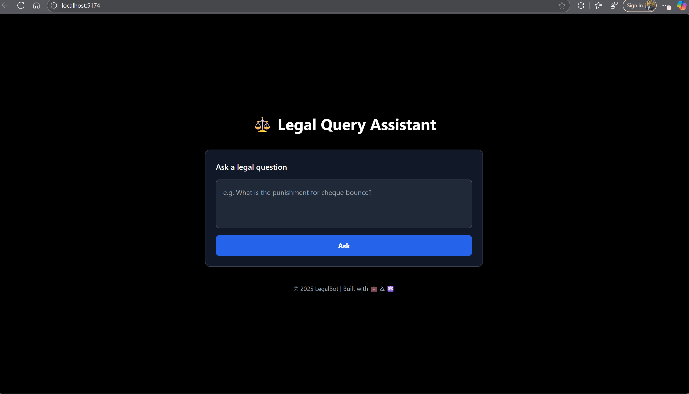

# ⚖️ Legal Query Assistant

A ChatGPT-style legal assistant web app built with **React**, **Vite**, and **Tailwind CSS**.  
Users can enter legal questions and get responses, citations, and simulated PDF highlighting.

---

## 🚀 How to Run the Project

1. **Clone the repository**:
```bash
git clone https://github.com/SahilEjaz/legal-query-app.git
cd legal-query-app
npm run dev

## 🌐 Live Demo

👉 [https://legal-query-app.vercel.app](https://legal-query-app.vercel.app)

## 📸 Screenshot




